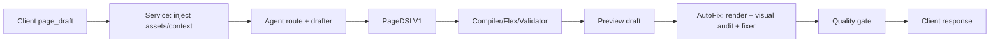
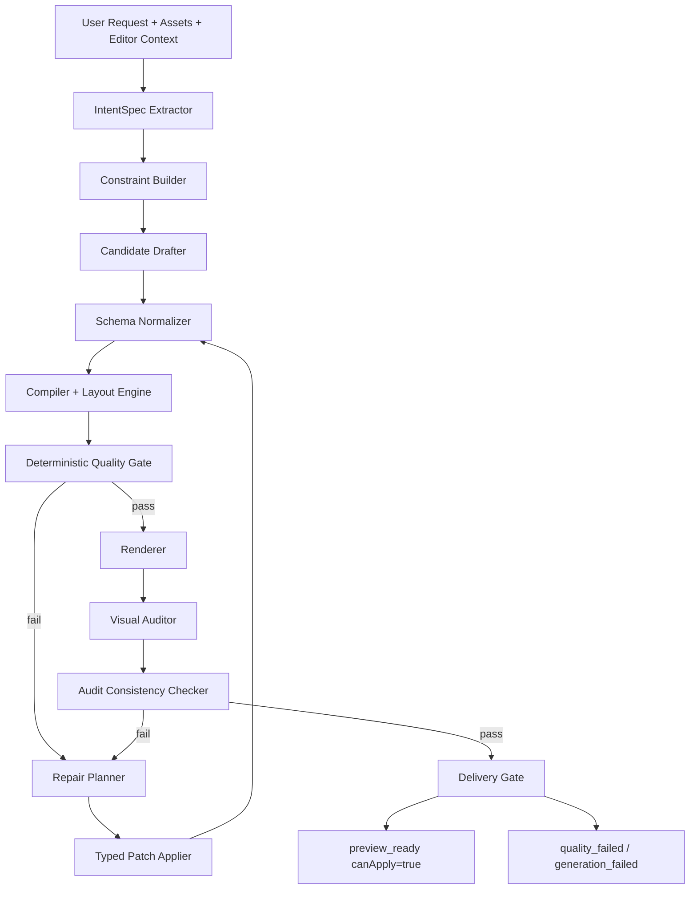

# AI 页面草稿质量闭环架构整改方案

## 1. 背景

2026-06-09 的联调请求 `req_5dcf88c5-9788-4345-a110-736ab61145b0` 暴露出一个系统性问题：

- 用户请求：生成登录页面，使用上传背景图和 logo。
- 服务端实际生成了 `page_background`、`brand_logo`、用户名/密码输入区、登录按钮等 7 个组件。
- 后端视觉审核给出 `score=35`，低于阈值 70。
- AutoFix 尝试修复，但 fixer 输出非法 PageDSLV1：`regions.1.align = "left"`，当前 schema 只允许 `fill | center`。
- AutoFix 终止为 `fixer_invalid`，最终仍返回 `preview_ready`，但 `preview.canApply=false`，同时 `status=needs_clarification` 且 `clarifications=[]`。

这个行为不符合编排服务职责。低质量草稿不是用户需要澄清的问题，也不应该变成客户端不可应用的 preview。客户端无法修复服务端生成质量，只能被迫重试，这不是闭环。

本文档目标是从全局架构解决问题，而不是针对登录页、logo、背景图写硬编码补丁。

## 2. 当前链路

当前实际链路可以抽象为：



这条链路的问题不是缺少某个模型调用，而是缺少“可交付结果”的强约束：

- Drafter 可以产出质量差的 DSL。
- Compiler 可以把 DSL 编译成视觉上不可用的布局。
- Visual auditor 可以给出低分或误判。
- Fixer 可以输出不符合 schema 的 DSL。
- Service 在修复失败后仍把不可应用草稿返回给客户端。

## 3. 事实与根因

### 3.1 本次请求事实

| 环节 | 事实 |
|---|---|
| 路由 | `recipePolicy=disabled`，走 `non_template` |
| 资源 | 后端构建 `available_assets`，上传背景图和 logo 均可访问 |
| 草稿 | 生成 7 个组件，含背景图和 logo |
| 布局质量 | 表单区域几乎全页宽，视觉质量差 |
| 审核 | `score=35`，原因包括 logo、输入框对比度、间距 |
| 修复 | fixer 输出 `align=left` |
| schema | PageDSLV1 只允许 `align=fill|center` |
| 结果 | AutoFix `fixer_invalid`，仍返回 `preview_ready` + `canApply=false` |

### 3.2 根因分层

#### 根因一：交付契约错误

`preview_ready` 被用于承载不可应用草稿。这违反了客户端语义。

正确语义应该是：

- `preview_ready`：服务端已生成可预览、可应用结果。
- `clarification_needed`：用户意图不明确，需要补充信息。
- `quality_failed` / `generation_failed`：服务端未能生成可交付结果。

低评分不是澄清。`status=needs_clarification` 但 `clarifications=[]` 是协议层错误。

#### 根因二：DSL、Prompt、Compiler 不一致

用户和 visual auditor 都会使用“左上角、右侧、底部”等空间概念。Fixer 输出 `align=left` 是自然结果，但 PageDSLV1 schema 不支持。

这说明当前系统中有三套不一致的语言：

- 用户语言：左上角、居中、右侧、顶部。
- Prompt 语言：alignment、position、spacing。
- DSL 语言：`align=fill|center`。

当 DSL 无法表达用户约束时，LLM 会发明字段或枚举，最终被 schema 拒绝。

#### 根因三：质量判断缺少确定性约束

当前视觉审核主要依赖图片模型。图片模型适合发现主观视觉问题，但不适合作为唯一质量门禁。

例如本次请求中，最终 componentPlan 的 logo bbox 是左上角附近，但 visual auditor 报告“logo 在中心/过大”。这类结论必须被结构化数据校验，否则会把误判传给 fixer。

缺失的确定性证据包括：

- 每个组件的 `x/y/w/h`。
- 资源绑定是否成功。
- 组件是否越界、重叠、过宽、过高。
- 用户要求的方位是否由 bbox 满足。
- 文本与背景的基础对比度。
- 页面主要区域是否符合设计系统的可用范围。

#### 根因四：Fixer 抽象过宽

当前 fixer 直接输出完整 PageDSLV1。这给 LLM 过大的破坏面：

- 可以修改不相关组件。
- 可以输出 schema 不支持的字段或枚举。
- 可以破坏资源 URL。
- 可以改变页面结构但无法证明每个改动对应哪个审核问题。

更合理的设计是让 fixer 输出受约束的 typed patch，再由后端 deterministic patch applier 生成新 DSL。

#### 根因五：AutoFix 失败策略错误

当前 AutoFix 遇到 fixer invalid 后直接终止，并返回原 DSL。随后质量门禁把 `canApply=false` 写进 preview。

这不是修复闭环，而是“尝试一次然后把失败暴露给客户端”。

服务端应该在内部完成以下决策：

- 能修：继续修到通过。
- 不能修：返回 `quality_failed`，并给开发可追踪原因。
- 意图不明：才返回 `clarification_needed`。

## 4. 架构原则

1. 拒绝页面级硬编码。
   所有约束应来自通用 `IntentSpec`、设计系统规则、组件能力、资源语义和用户输入，而不是针对“登录页 + logo”写 if/else。

2. 区分意图问题和质量问题。
   意图不明确才问用户；质量不合格由服务端修复或失败。

3. 服务端对可交付质量负责。
   客户端只消费 `canApply=true` 的草稿，不负责帮服务端重试低分结果。

4. LLM 只能在契约内工作。
   Prompt、schema、compiler、validator 必须共享同一份能力定义。

5. 主观审核不能单独决定质量。
   视觉模型输出必须经过结构化一致性校验。

6. 修复必须可验证、可回滚、可观测。
   每轮修复要记录输入、patch、编译结果、审核结果和失败原因。

## 5. 目标架构



### 5.1 核心对象

#### IntentSpec

用于表达用户意图，不直接表达像素实现。

建议字段：

```json
{
  "page_kind": "login | dashboard | settings | custom",
  "required_components": [
    {"role": "brand_logo", "required": true},
    {"role": "page_background", "required": true},
    {"role": "username_input", "required": true}
  ],
  "asset_requirements": [
    {"usage_kind": "logo", "target_role": "brand_logo"},
    {"usage_kind": "full_background", "target_role": "page_background"}
  ],
  "layout_constraints": [
    {"role": "brand_logo", "anchor": "top_left", "priority": "must"},
    {"role": "login_form", "anchor": "center", "priority": "should"}
  ],
  "visual_constraints": [
    {"type": "contrast", "target_roles": ["username_input", "password_input"], "priority": "should"}
  ],
  "ambiguity": {
    "level": "low",
    "questions": []
  }
}
```

这里的 `page_kind=login` 不是硬编码布局，而是意图分类。布局仍由约束、设计系统和组件能力决定。

#### ConstraintSpec

由 IntentSpec、组件能力表、设计系统规则生成。

示例：

```json
{
  "bbox_constraints": [
    {
      "role": "brand_logo",
      "anchor": "top_left",
      "margin_px": {"x_min": 0, "x_max": 32, "y_min": 0, "y_max": 32},
      "max_area_ratio": 0.04
    }
  ],
  "layout_constraints": [
    {
      "role": "form_container",
      "max_width_ratio": 0.55,
      "max_width_px": 520,
      "anchor": "center"
    }
  ],
  "resource_constraints": [
    {"role": "brand_logo", "must_have_src": true},
    {"role": "page_background", "must_have_src": true}
  ]
}
```

这些规则应配置化、可测试、可按组件类型和页面意图组合，而不是散落在代码里。

#### QualityReport

后端统一质量报告，合并确定性 gate 和视觉 gate。

```json
{
  "pass": false,
  "score": 35,
  "blocking_issues": [
    {
      "source": "deterministic_gate",
      "code": "FORM_WIDTH_EXCEEDS_MAX",
      "component_role": "login_form",
      "evidence": {"actual_width": 1004, "max_width": 520}
    }
  ],
  "advisory_issues": [
    {
      "source": "visual_auditor",
      "code": "SPACING_UNEVEN",
      "component_role": "form_area"
    }
  ]
}
```

#### RepairPatch

Fixer 不再返回完整 PageDSLV1，而是返回受限 patch。

```json
{
  "patches": [
    {
      "op": "set_region_max_width",
      "region_id": "form_area",
      "value": 420,
      "reason": "form container exceeds design-system max width"
    },
    {
      "op": "set_region_anchor",
      "region_id": "logo_area",
      "value": "top_left",
      "reason": "user requested logo at top-left"
    }
  ]
}
```

Patch applier 必须由后端实现，负责：

- 校验 patch op 是否允许。
- 校验字段值是否符合 schema。
- 应用 patch 后重新编译。
- 保证资源字段不丢失。
- 记录 diff。

## 6. 具体实现方案

### 6.1 协议整改

#### 现状

低分结果返回：

```json
{
  "responseType": "preview_ready",
  "status": "needs_clarification",
  "preview": {"canApply": false},
  "clarifications": []
}
```

#### 目标

协议必须满足不变量：

- `responseType=preview_ready` 时，`preview.canApply` 必须为 true。
- `responseType=clarification_needed` 时，`clarifications` 必须非空。
- 质量失败返回 `quality_failed`。
- 生成失败返回 `generation_failed`。

建议结构：

```json
{
  "responseType": "quality_failed",
  "status": "failed",
  "error": {
    "code": "quality_gate_unresolved",
    "user_message": "页面草稿未达到可应用质量，服务端已停止返回不可应用草稿。",
    "retryable": false,
    "details": {
      "requestId": "req_xxx",
      "traceId": "trace_xxx",
      "final_score": 35,
      "terminated_reason": "fixer_invalid"
    }
  }
}
```

内部可以保存 debug preview，但不能作为用户可应用草稿返回。

### 6.2 IntentSpec 与 Constraint Builder

新增通用意图与约束层：

1. 从用户文本、上传资源、editorContext 中抽取 IntentSpec。
2. 识别 required components、asset bindings、position anchors、quality requirements。
3. 若必需信息缺失，返回 clarification。
4. 若信息完整，进入生成闭环。

示例判定：

- 用户说“logo 放左上角”且上传了 `usage_kind=logo`：
  - 生成 `brand_logo` required component。
  - 生成 `asset_requirement logo -> brand_logo`。
  - 生成 `bbox_constraint role=brand_logo anchor=top_left`。

这不是硬编码登录页，而是对用户显式约束的结构化表达。

### 6.3 DSL 能力契约对齐

当前 `align=fill|center` 不足以表达方位约束。

推荐两种方案，优先方案 A。

#### 方案 A：扩展布局语义

扩展 region/component 的布局能力：

```json
{
  "align": "fill | center | start | end",
  "anchor": "top_left | top_right | bottom_left | bottom_right | center",
  "max_width": 420,
  "max_height": 120
}
```

compiler 负责把 `anchor` 和 `max_width/max_height` 转成 componentPlan 的 bbox。

优点：

- 表达能力完整。
- 用户语言、prompt、schema、compiler 对齐。
- Fixer 不需要发明非法值。

代价：

- 需要改 schema、compiler、validator、测试。
- 需要兼容旧 DSL。

#### 方案 B：保持 DSL 简单，增加 Constraint Layer

DSL 继续只描述组件结构，所有方位和尺寸约束放入 ConstraintSpec，由 layout engine 读取。

优点：

- DSL 变动小。
- 约束层更通用。

代价：

- 需要让 compiler/layout engine 支持外部 constraints。
- 调试时要同时看 DSL 和 constraints。

建议采用 A+B 的组合：DSL 支持基础布局语义，ConstraintSpec 表达更强的验收规则。

### 6.4 Deterministic Quality Gate

在 visual auditor 前加入确定性 gate。它不依赖模型，直接检查 componentPlan 和资源。

必须检查：

1. 资源绑定
   - required asset 是否绑定到目标 role。
   - `src`、`ai_image_url` 是否存在且可访问。

2. bbox 约束
   - top-left、center、bottom 等 anchor 是否由 `x/y/w/h` 满足。
   - 组件是否越界。
   - 组件是否异常过大或过小。

3. 布局可用性
   - 表单、按钮、文本区域是否超过设计系统范围。
   - 组件是否严重重叠。
   - 关键组件是否被背景遮挡。

4. 基础视觉
   - 明确颜色的文本与背景对比度。
   - 图片背景下的输入框是否有足够填充/边框。

5. 组件语义
   - `login_button` 必须是 action/button 类型。
   - `brand_logo` 必须是 image 类型且绑定 logo 资源。
   - `page_background` 必须位于底层并覆盖页面。

这些规则应由组件能力表和设计系统配置驱动，不写死某个页面。

### 6.5 Visual Auditor 改造

Visual auditor 继续保留，但职责从“唯一裁判”降级为“主观视觉补充”。

输入需要增强：

```json
{
  "screenshot_png": "...",
  "user_message": "...",
  "component_summary": [
    {
      "componentId": "brand_logo",
      "semanticRole": "brand_logo",
      "componentType": "image",
      "bbox": {"x": 10, "y": 10, "w": 80, "h": 80},
      "assetUsage": "logo"
    }
  ],
  "deterministic_gate_report": {...}
}
```

新增 Audit Consistency Checker：

- 如果 auditor 说 “brand_logo 不在左上角”，但 bbox 满足 top-left constraint，则该 issue 降级或触发 re-audit。
- 如果 auditor 指出的 componentId 不存在，则该 issue 不能阻塞。
- 如果 auditor 的 suggested patch 使用 schema 不支持字段，不能直接传给 fixer。

### 6.6 Fixer 改造

#### 当前问题

Fixer 输出完整 DSL，导致 schema 破坏。

#### 目标

Fixer 输出 typed patch：

- `set_region_anchor`
- `set_region_max_width`
- `set_component_prop`
- `move_component_to_region`
- `add_component`
- `remove_component`
- `set_component_role`

Patch schema 由后端定义并校验。LLM 不能自由写未知字段。

Patch applier 应提供：

1. patch schema validation。
2. capability validation。
3. resource preservation。
4. compile validation。
5. diff summary。

如果 patch 非法：

- 第一次：把 validation error 回传 fixer，让它修正 patch。
- 第二次：使用 deterministic repair planner 处理可机械修复的问题。
- 仍失败：返回 `quality_failed`，不返回不可应用 preview。

### 6.7 AutoFix Loop 改造

当前循环：

```text
audit -> fixer -> invalid -> stop -> return low-score preview
```

目标循环：

```text
compile -> deterministic gate -> render -> visual audit -> consistency check
    -> repair patch -> apply patch -> compile -> re-check
    -> pass: preview_ready(canApply=true)
    -> exhausted: quality_failed
```

建议规则：

- 默认最大轮次 2，最高 3。
- 每轮必须分数或 deterministic gate 通过项数量改善。
- Fixer invalid 不直接终止，先进入 schema repair/retry。
- 如果 visual auditor 与 bbox evidence 冲突，不能作为 blocking issue。
- 如果 deterministic gate 发现硬性约束不满足，优先 deterministic repair。

### 6.8 Delivery Gate

新增最终交付门禁，位于所有修复后。

交付不变量：

```text
if result is preview_ready:
    assert canApply == true
    assert quality_gate.pass == true
    assert validationIssues has no blocking issue
    assert clarifications is empty

if result is clarification_needed:
    assert clarifications is not empty
    assert reason is intent/resource ambiguity

if quality failed:
    responseType = quality_failed
    do not expose applyable preview
```

这一步可以先用测试保护，不需要一次性重构所有模块。

### 6.9 客户端职责调整

xdisplay 客户端不应该处理低质量修复。

客户端职责：

- 发送请求、上传资产、展示可应用 preview。
- 展示 `clarification_needed` 的问题。
- 展示 `quality_failed` 的失败摘要和 requestId/traceId。
- 保留附件，允许用户改描述后重新请求。

客户端不应该：

- 对 `canApply=false` 的 preview 展示应用按钮。
- 把质量失败当 clarification。
- 通过再发一次相同请求帮服务端修复。

## 7. 分阶段落地计划

### P0：协议与门禁止血

目标：不再把低质量草稿当 preview 返回客户端。

任务：

1. 增加协议不变量测试：
   - `preview_ready => canApply=true`
   - `clarification_needed => clarifications 非空`
   - quality gate blocked => `quality_failed`

2. 修改 service response mapping：
   - AutoFix 失败且低于阈值时返回 `quality_failed`。
   - failed draft 可进入内部 debug store，但不返回为用户 preview。

3. 保留客户端附件：
   - `quality_failed` 不清空 chatUploadedAssets。

验收：

- 同类低分请求不再出现 `preview_ready + canApply=false`。
- Qt 不再进入“可见 preview 但不可应用”的状态。

### P1：修复 schema/fixer 合同

目标：fixer 不再因可机械修复的 schema 错误中断。

任务：

1. 扩展或规范化布局语义：
   - 支持 `start/end/anchor`，或引入 ConstraintSpec。

2. Fixer 改 typed patch 输出。

3. Patch applier 实现：
   - validate patch。
   - apply patch。
   - preserve asset fields。
   - recompile。

4. Fixer invalid retry：
   - 把 validation error 作为输入重新修一次。

验收：

- `align=left` 一类错误不再导致 `fixer_invalid` 终止。
- fixer 不能破坏 `src` / `ai_image_url`。

### P2：确定性质量 gate

目标：模型审核前先用结构化规则发现和修复客观问题。

任务：

1. 实现 Deterministic Quality Gate。
2. 实现 Constraint Builder。
3. 把 bbox、资源绑定、设计系统限制纳入 QualityReport。
4. 将 deterministic issue 转成 repair patch。

验收：

- 表单全宽、logo 尺寸异常、资源未绑定、越界、严重重叠能在不调用视觉模型时被发现。
- 这些问题能被 repair patch 修复或明确返回 `quality_failed`。

### P3：视觉审核一致性校验

目标：避免模型误判直接阻断交付。

任务：

1. auditor 输入增加 bbox 和 deterministic report。
2. auditor 输出必须引用有效 componentId。
3. consistency checker 校验 visual issue 与 bbox evidence。
4. 对冲突 issue 降权或 re-audit。

验收：

- auditor 报 “logo 居中” 但 bbox 在左上角时，不得直接阻断。
- visual issue 必须能映射到 patch 或 advisory。

### P4：观测与发布治理

目标：质量闭环可观测、可回归。

任务：

1. 增加指标：
   - `quality_gate_pass_rate`
   - `autofix_loop_count`
   - `fixer_invalid_total`
   - `quality_failed_total`
   - `preview_ready_can_apply_false_total`

2. trace artifacts：
   - IntentSpec
   - ConstraintSpec
   - initial DSL
   - componentPlan
   - screenshot
   - audit report
   - repair patches
   - final QualityReport

3. 远端环境冻结：
   - 记录 commit、image tag、config overrides、prompt versions。
   - 禁止文档、本地、远端、容器四套状态漂移。

验收：

- 任一低分请求可以从 requestId 追踪到具体失败环节。
- 发布前能用 golden tests 证明不回归。

## 8. 闭环验证方案

### 8.1 单元测试

| 测试 | 目标 |
|---|---|
| protocol invariant | 禁止 `preview_ready + canApply=false` |
| clarification invariant | 禁止 `clarification_needed + clarifications=[]` |
| schema normalizer | 非法布局值可被规范化或明确失败 |
| patch schema | fixer 不能输出未知 op/field |
| asset preservation | 修复过程不得丢失 `src/ai_image_url` |
| deterministic bbox gate | top-left/center/bounds 约束可验证 |
| audit consistency | visual issue 与 bbox 冲突时不阻断 |

### 8.2 集成测试

#### Golden Case A：上传 logo + full background

输入：

```text
生成一个登录页面，logo 放到左上角合适的位置，全屏背景图使用上传的背景图片。
```

资产：

- `usage_kind=logo`
- `usage_kind=full_background`

期望：

- `responseType=preview_ready`
- `preview.canApply=true`
- `brand_logo` 绑定 logo 资产。
- `page_background` 绑定背景资产。
- logo bbox 满足 top-left constraint。
- form/container 不超过设计系统宽度约束。
- 无 `autofix.quality_gate.blocked`。

#### Golden Case B：fixer 输出非法字段

模拟 fixer patch 或 DSL 包含非法字段。

期望：

- 后端进入 schema repair/retry。
- 若修复成功，返回 `preview_ready(canApply=true)`。
- 若修复失败，返回 `quality_failed`。
- 不返回不可应用 preview。

#### Golden Case C：visual auditor 误判

构造 bbox 明确在左上角，但 auditor 返回 “not top-left”。

期望：

- consistency checker 降权该 issue。
- 不因该 issue 阻断交付。

### 8.3 E2E 稳定性测试

同一 golden request 连续跑 20 次。

通过标准：

- `preview_ready` 成功率达到目标阈值。
- 所有 `preview_ready` 都 `canApply=true`。
- `quality_failed` 有明确 machine-readable reason。
- 无 `needs_clarification` 空问题。
- 无 `fixer_invalid` 未处理后直接返回 preview。

### 8.4 人工验收

人工验收只看最终交付物，不参与服务端修复：

1. 页面是否应用成功。
2. 上传背景是否显示。
3. 上传 logo 是否显示并满足方位。
4. 表单是否可读、不过宽、不溢出。
5. 若失败，客户端是否展示明确失败态，而不是不可应用草稿。

## 9. 成功标准

本问题真正解决的标准不是某一次联调成功，而是以下架构不变量成立：

1. 低质量结果不会作为可预览草稿交给客户端。
2. 意图不明确和质量失败在协议上严格区分。
3. 用户显式约束会进入结构化 IntentSpec/ConstraintSpec。
4. DSL、prompt、compiler 的布局语言一致。
5. Fixer 只能输出受控 patch。
6. Visual auditor 的结论会被结构化证据校验。
7. 最终结果只有两种：可应用，或明确失败。

## 10. 对当前问题的直接判断

当前架构不是完全错误，但关键闭环缺失：

- 有生成。
- 有审核。
- 有修复尝试。
- 有门禁。
- 但没有“修复失败后的正确交付语义”。
- 也没有“约束驱动的确定性质量控制”。

因此继续只改 prompt、调模型、加单点 recipe，都不能根治。根治必须把质量从“模型建议”提升为“服务端交付契约”。
